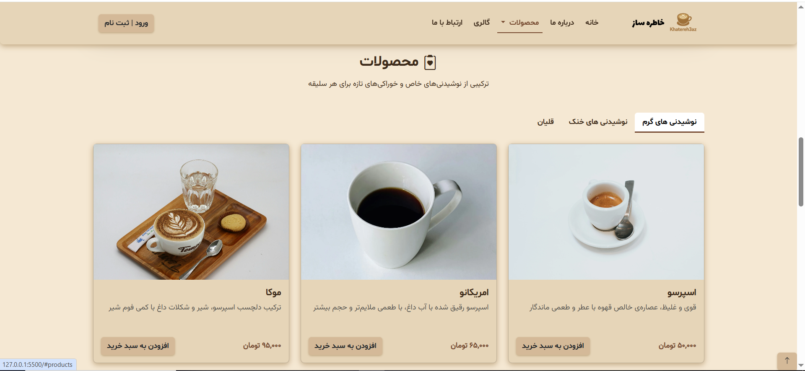
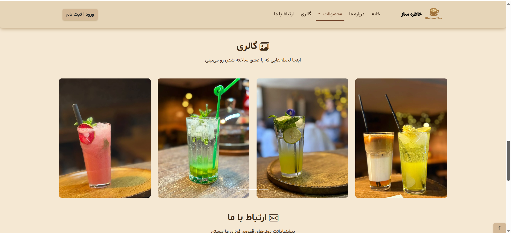
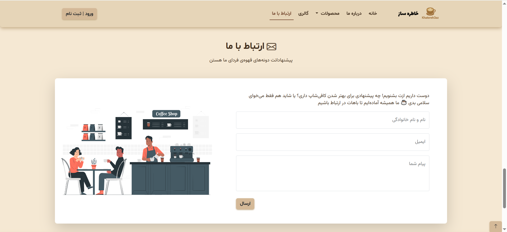

# ☕ کافی‌شاپ خاطره‌ساز


یک وب‌سایت **مدرن، واکنش‌گرا و حرفه‌ای** برای کافی‌شاپ خاطره‌ساز، با تمرکز بر **تجربه کاربری، سرعت و زیبایی بصری**.

---

## 🌐 پیش‌نمایش آنلاین

<div align="center">
  <a href="https://reza-pourrajab.github.io/Khatere3az-Cafe/" target="_blank">
    
  </a>
  <a href="https://github.com/reza-pourrajab/Khatere3az-Cafe" target="_blank">
    
  </a>
</div>

---

## 🎯 هدف پروژه

این پروژه به عنوان یک تمرین عملی برای یادگیری **HTML، CSS و Bootstrap** ایجاد شده است.  
هدف اصلی، ساخت یک وب‌سایت **زیبا، واکنش‌گرا و حرفه‌ای** با تمرکز بر **Front-End Development** است.

---

## ⚡ ویژگی‌های برجسته

### 💻 واکنش‌گرایی کامل (Responsive)

- طراحی واکنش‌گرا برای موبایل، تبلت و دسکتاپ
- استفاده از **Bootstrap Grid** و کلاس‌های مدرن برای چیدمان انعطاف‌پذیر
- تصاویر و بخش‌ها به‌صورت خودکار با اندازه صفحه نمایش تنظیم می‌شوند

### 🚀 بهینه‌سازی سرعت و عملکرد

- تصاویر با فرمت WebP و نسخه موبایل برای بخش Hero
- فشرده‌سازی و **lazy-loading** تصاویر
- CSS بحرانی و بارگذاری ناهمزمان CSS غیر بحرانی
- پیش‌بارگذاری فونت‌ها و تصاویر مهم برای کاهش **LCP** و بهبود **FCP**

### 🎨 طراحی و فونت‌های فارسی سفارشی

- استفاده از فونت‌های **Lalezar، Shabnam و Vazir** با بارگذاری بهینه
- هماهنگی فونت‌ها با طراحی کلی سایت

### 🧭 ناوبری پیشرفته و UX

- هدر چسبان (Sticky Header)
- منوی کشویی محصولات با دسته‌بندی واضح
- اسکرول نرم و فعال‌سازی خودکار بخش‌ها (**Scrollspy**)

### 🖼️ گالری و نمایش محصولات

- نمایش محصولات در سه دسته: نوشیدنی‌های گرم، خنک و قلیان
- کارت‌های محصولات با دکمه افزودن به سبد خرید
- گالری تصاویر بهینه و اسلایدر جذاب

### ♿ دسترسی‌پذیری و استانداردها

- استفاده از **aria-label** و **role** برای عناصر مهم
- قابلیت استفاده با کیبورد و تب‌بندی مناسب
- رعایت استانداردهای SEO و Open Graph

### ⚙️ کدنویسی تمیز و ساختارمند

- جداسازی CSS اصلی و واکنش‌گرا
- ساختار منظم HTML5 و Bootstrap
- آماده برای توسعه و افزودن امکانات جدید

---

## 📸 اسکرین‌شات‌ها

### 1. Home Page / صفحه اصلی


_نمای کلی صفحه اصلی و بخش Hero_

### 2. Products / منوی محصولات


_کارت‌های محصول و دسته‌بندی‌ها_

### 3. Gallery / گالری


_نمونه‌ای از گالری تصاویر یا بخش ویژه سایت_

### 4. Contact Form / فرم تماس


_فرم ارسال پیام کاربران به سایت_

---

## 🚀 نحوه اجرا

1. پروژه را دانلود یا کلون کنید:
   ```bash
   git clone https://github.com/reza-pourrajab/Khatere3az-Cafe.git
   ```
2. پوشه پروژه را باز کنید و فایل `index.html` را در مرورگر اجرا کنید
3. برای بهترین عملکرد، پروژه را روی یک **سرور محلی** اجرا کنید

---

## 📁 ساختار پوشه‌ها

index.html
fonts/
images/
js/
styles/

- `index.html`: فایل اصلی HTML
- `fonts/`: فونت‌های سفارشی
- `images/`: تصاویر پروژه
- `js/`: فایل‌های JavaScript (تولید شده با AI)
- `styles/`: فایل‌های CSS سفارشی و Bootstrap

---

## 💡 نکات مهم

- تمام JavaScript: **تولید شده با AI**
- طراحی و HTML/CSS: ساخته شده برای **تمرین و یادگیری**
- Bootstrap: [https://getbootstrap.com/](https://getbootstrap.com/)
- فونت‌ها: موجود در پوشه `fonts/`

---

## 📝 مجوز

این پروژه برای **آموزش و تمرین شخصی** ایجاد شده است. لطفاً حقوق منابع شخص ثالث را رعایت کنید.
