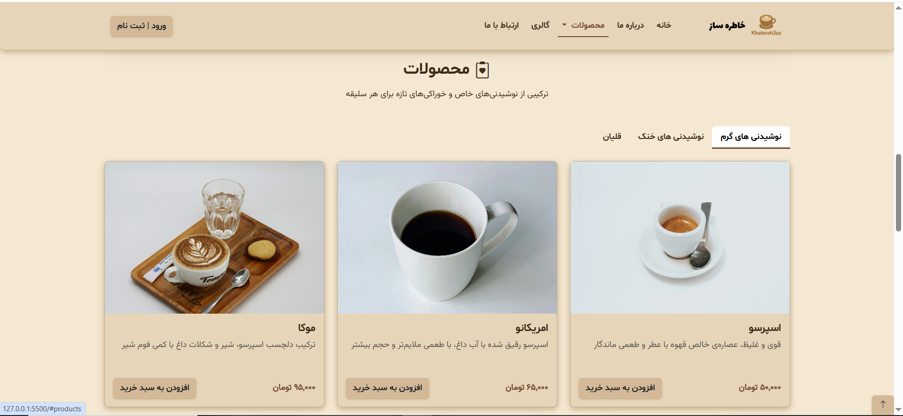
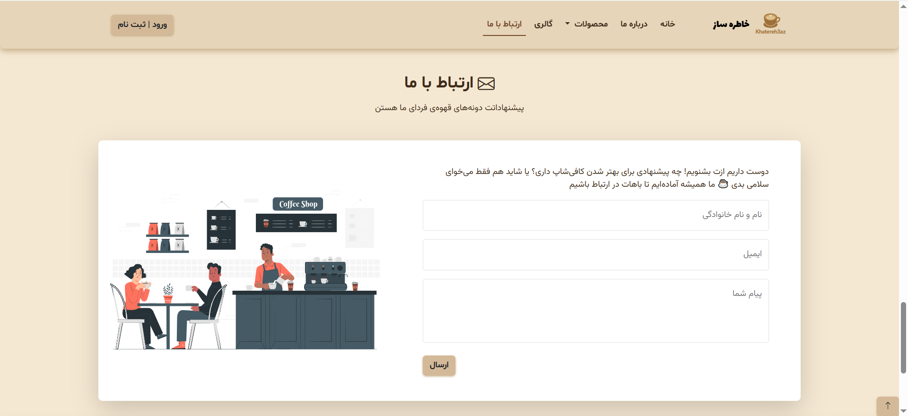

# ☕ Khatere3az Cafe


A **modern, responsive, and professional** website for Khatere3az Cafe, focusing on **user experience, speed, and visual appeal**.

---

## 🌐 Live Preview

<div align="center">
  <a href="https://reza-pourrajab.github.io/Khatere3az-Cafe/" target="_blank">
    
  </a>
  <a href="https://github.com/reza-pourrajab/Khatere3az-Cafe" target="_blank">
    
  </a>
</div>

---

## 🎯 Project Purpose

This project was created as a hands-on exercise for learning **HTML, CSS, and Bootstrap**.  
The main goal is to build a **beautiful, responsive, and professional website** focusing on **Front-End Development** skills.

---

## ⚡ Key Features

### 💻 Full Responsiveness

- Responsive design for mobile, tablet, and desktop
- Using **Bootstrap Grid** and modern classes for flexible layouts
- Sections and images automatically adjust to screen size

### 🚀 Speed and Performance Optimization

- Images in WebP format and mobile version for Hero section
- Image compression and **lazy-loading**
- Critical CSS and asynchronous loading for non-critical CSS
- Preloading important fonts and images to reduce **LCP** and improve **FCP**

### 🎨 Custom Fonts and Design

- Using **Lalezar, Shabnam, and Vazir** fonts with optimized loading
- Fonts coordinated with overall website design

### 🧭 Advanced Navigation & UX

- Sticky Header
- Dropdown menu for products with clear categories
- Smooth scrolling and automatic section activation (**Scrollspy**)

### 🖼️ Gallery and Product Display

- Displaying products in three categories: hot drinks, cold drinks, and hookah
- Product cards with "Add to Cart" buttons
- Optimized image gallery with slider

### ♿ Accessibility & Standards

- Using **aria-label** and **role** for important elements
- Keyboard-friendly tab navigation
- SEO and Open Graph best practices

### ⚙️ Clean and Structured Code

- Separation of main and responsive CSS
- Organized HTML5 structure with Bootstrap
- Ready for further development and feature additions

---

## 📸 Screenshots

### 1. Home Page


_Overview of the home page and the Hero section_

### 2. Products / Menu


_Product cards and category layout_

### 3. Gallery


_Example of the image gallery or featured section_

### 4. Contact Form


_Form for users to send messages to the website_

---

## 🚀 How to Run

1. Download or clone the project:
   ```bash
   git clone https://github.com/reza-pourrajab/Khatere3az-Cafe.git
   ```
2. Open the project folder and run `index.html` in your browser
3. For best performance, run the project on a **local server**

---

## 📁 Folder Structure

index.html
fonts/
images/
js/
styles/

- `index.html`: Main HTML file
- `fonts/`: Custom fonts
- `images/`: Project images
- `js/`: JavaScript files (AI-generated)
- `styles/`: Custom CSS and Bootstrap

---

## 💡 Important Notes

- All JavaScript: **AI-generated**
- HTML/CSS: created for **practice and learning purposes**
- Bootstrap: [https://getbootstrap.com/](https://getbootstrap.com/)
- Fonts: included in `fonts/` directory

---

## 📝 License

This project is created for **educational and personal practice purposes**.  
Please respect the original sources of any third-party assets.
